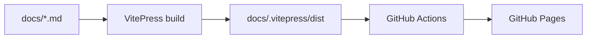

<div align="center">

# 📚 AiKnowledge

**AI 学习知识库 —— AI 面试题、分类学习资料与资源导航，一站式沉淀**

[](./LICENSE)
[](https://vitepress.dev/)
[](https://cvenwu.github.io/AiKnowledge/)

[在线访问](https://cvenwu.github.io/AiKnowledge/) · [面试题](#-内容地图) · [学习](#-内容地图) · [资源](#-内容地图)

</div>

---

## 📖 简介

**AiKnowledge** 是一个用 VitePress 构建的 AI 学习知识库，聚焦大模型与 AI Agent 方向，覆盖面试题、系统化学习资料与优质资源导航。

## 🗺️ 内容地图

| 板块 | 目录 | 内容 |
|------|------|------|
| 面试题 | [`docs/interview/`](docs/interview/) | AI / LLM / Agent 高频面试题与解析 |
| 学习 | [`docs/learning/`](docs/learning/) | 分类学习资料（原理、推理参数、RAG 等） |
| 资源 | [`docs/resources/`](docs/resources/) | 优质教程、仓库与工具导航 |
| 指南 | [`docs/guide/`](docs/guide/) | 使用与贡献说明 |

## 🏗️ 部署流程



## 💻 本地开发

```bash
npm install
npm run docs:dev     # 本地预览
npm run docs:build   # 构建检查
npm run docs:preview # 预览构建结果
```

## 📄 License

[Apache License 2.0](./LICENSE)
